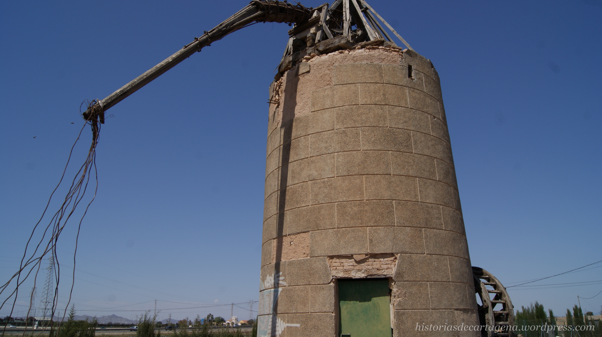

# Molino de Viento Lo Negrete - Finca Lo Negrete



## 🌾 Descripción del Proyecto

Sitio web oficial para la **restauración y difusión del Molino de Viento Lo Negrete**, ubicado en la Finca Lo Negrete, Cartagena, Murcia. Este proyecto documenta y preserva un importante patrimonio histórico de 1914, catalogado como **Nº 29 en el Plan Director de los Molinos de Viento de la Región de Murcia**.

### 📍 Ubicación
- **Dirección**: Finca Lo Negrete, Cartagena, Murcia, España
- **Coordenadas**: 37.647739, -0.980533
- **Año de construcción**: 1914
- **Tipología**: Molino de arcaduces para extracción de agua

## 🏛️ Historia

El molino de viento de la Finca Lo Negrete representa más de un siglo de historia agrícola murciana. Construido en **1914**, este ingenioso sistema de extracción de agua transformó las áridas tierras de secano en fértiles campos de regadío, siendo un testimonio vivo de la adaptación del hombre al clima mediterráneo.

### Cronología Histórica
- **1914**: Construcción del molino siguiendo técnicas tradicionales
- **1914-1957**: Período de uso activo para riego agrícola
- **1957-1970**: Declive por la llegada de métodos modernos
- **1970-2000**: Período de abandono y deterioro
- **2018**: Inicio de la búsqueda de financiación
- **2024**: Aprobación de subvención gubernamental
- **2025**: Fase actual de planificación y restauración

## 🔧 Características Técnicas

### Sistema de Funcionamiento
- **Tipo**: Molino de arcaduces
- **Energía**: Eólica
- **Función**: Extracción de agua subterránea
- **Ubicación del pozo**: Exterior de la torre
- **Material de construcción**: Piedra caliza local

### Componentes Principales
- Torre cilíndrica de mampostería
- Sistema de aspas orientables
- Rueda de arcaduces
- Pozo subterráneo
- Balsa de almacenamiento
- Mecanismo de transmisión

## 🌐 Sitio Web

El sitio web incluye:

### 📸 Galería Fotográfica
- Vista frontal del molino
- Vista lateral del molino  
- Sistema de noria frontal y lateral
- Pozo subterráneo
- Balsa de almacenamiento actual

### 📐 Documentación Técnica
- Planos históricos originales
- Esquemas de funcionamiento
- Detalles constructivos
- Principios de funcionamiento

### 🎯 Contenido Educativo
- Historia completa del molino
- Explicación del sistema de arcaduces
- Importancia del patrimonio rural
- Técnicas tradicionales de irrigación

## 🚀 Proyecto de Restauración

### Estado Actual
- ✅ **Financiación aprobada** (2024)
- 🔄 **Planificación en curso** (2025)
- 📋 Estudios técnicos completados
- 🎯 **Progreso**: 25%

### Objetivos
1. **Restauración estructural** completa
2. **Conservación del patrimonio** histórico
3. **Creación de centro cultural** educativo
4. **Promoción del turismo** rural
5. **Investigación** sobre molinos tradicionales

### Trabajos Previstos
- Consolidación de la estructura de piedra
- Restauración de la maquinaria original
- Recuperación de elementos arquitectónicos
- Instalación de sistemas de seguridad
- Creación de infraestructura para visitantes

## 🎓 Planes Futuros

### Actividades Culturales
- 🎓 **Visitas educativas** guiadas
- 🎨 **Exposiciones** temporales sobre patrimonio rural
- 🌍 **Rutas turísticas** integradas
- 🔬 **Centro de investigación** sobre molinos históricos

### Experiencia Visitante
- 🏛️ **Museo al aire libre** con paneles informativos
- 📱 **App móvil** con realidad aumentada
- 🎪 **Eventos especiales** y jornadas culturales
- 🌱 **Talleres de educación** ambiental

### Turismo y Comunidad
- 🍷 **Turismo gastronómico** con productos locales
- 🏃 **Rutas activas** de senderismo y cicloturismo
- 👥 **Actividades comunitarias** con asociaciones
- 🎬 **Producciones audiovisuales** educativas

## 📱 Tecnología del Sitio Web

### Características Técnicas
- **HTML5** semántico y accesible
- **CSS3** con animaciones y efectos modernos
- **JavaScript** vanilla para interactividad
- **Responsive Design** para todos los dispositivos
- **Optimización SEO** completa

### Funcionalidades
- 🖼️ **Galería de imágenes** con zoom modal
- 🗺️ **Mapa interactivo** de ubicación
- ⚡ **Animaciones suaves** y efectos parallax
- 📱 **Diseño responsive** optimizado
- 🎨 **Interfaz moderna** y atractiva
- 📊 **Google Analytics** integrado

### Recursos Multimedia
- Imágenes optimizadas en formato WebP
- Documentación técnica histórica
- Integración con Google Maps
- Galería fotográfica interactiva

## 📂 Estructura del Proyecto

```
molino-lo-negrete/
├── index.html              # Página principal
├── visitas.html           # Información para visitantes
├── colaboracion.html      # Página de colaboración
├── noticias.html          # Noticias del proyecto
├── blog.html              # Blog sobre patrimonio
├── images/                # Galería fotográfica
│   ├── molino-frontal.webp
│   ├── molino-lateral.webp
│   ├── noria-frontal.webp
│   ├── noria-lateral.webp
│   ├── pozo.webp
│   ├── balsa-del-molino.webp
│   ├── molino-base-piedra-caliza.webp
│   └── esquema-molino-agua.jpg
├── README.md              # Este archivo
├── LICENSE                # Licencia del proyecto
└── .gitignore            # Archivos ignorados por Git
```

## 🌐 GitHub Pages

El sitio web está desplegado usando GitHub Pages y es accesible en:
**https://aconesac.github.io/molino-lo-negrete/**

### Para habilitar GitHub Pages:
1. Ve a la página del repositorio en GitHub
2. Navega a **Settings** → **Pages**
3. Selecciona **Deploy from a branch**
4. Elige **main branch** y **/ (root)**
5. Guarda la configuración

## 📧 Contacto e Información

### Ubicación del Molino
- **Dirección**: Finca Lo Negrete, Cartagena, Murcia
- **Acceso**: Desde autovía del Mediterráneo (AP-7)
- **Aparcamiento**: Disponible en los alrededores

### Estado del Proyecto
- **Situación actual**: En fase de restauración
- **Apertura al público**: Tras finalización de obras
- **Información**: Pendiente de confirmar datos de contacto

## 🏛️ Patrimonio Cultural

Este molino forma parte del **patrimonio cultural de Cartagena** y está incluido en el **Catálogo de Molinos del Plan Director de los Molinos de Viento de la Región de Murcia** con el número **29**.

### Valor Histórico
- Testimonio de la **agricultura tradicional** murciana
- Ejemplo de **ingeniería popular** del siglo XX
- Representación de la **adaptación al clima** mediterráneo
- Patrimonio de **técnicas de irrigación** históricas

### Importancia Cultural
- Elemento **identitario del paisaje** rural cartagenero
- **Memoria histórica** de las técnicas agrícolas
- **Valor educativo** sobre sostenibilidad histórica
- **Referente turístico** del patrimonio industrial

## 📜 Licencia

Este proyecto está licenciado bajo los términos especificados en el archivo [LICENSE](LICENSE).

---

**© 2025 Molino de Viento - Finca Lo Negrete**  
*Patrimonio Cultural de Cartagena - Un proyecto de restauración y conservación del patrimonio rural español*

---

### 🤝 Contribuciones

Si deseas contribuir al proyecto o tienes información histórica adicional sobre el molino, no dudes en contactarnos o abrir un issue en este repositorio.

### 📺 Enlaces de Interés

- [Plan Director de Molinos de Viento - Región de Murcia](http://www.carm.es)
- [Patrimonio Cultural de Cartagena](https://www.cartagena.es/cultura)
- [Turismo Rural Murcia](https://www.murciaturistica.es)

**¡Ayúdanos a preservar este importante patrimonio histórico!** 🌾
